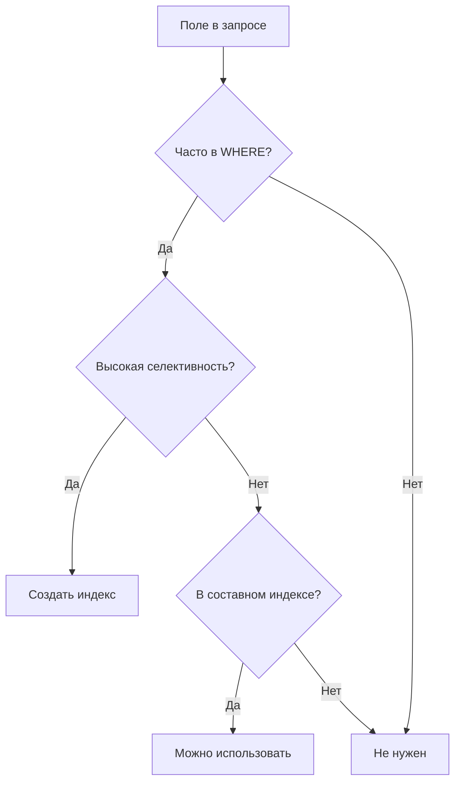

## 📚 Индексы в базах данных: полное руководство

### 1. Что такое индекс? 🤔

**Индекс** — это структура данных, которая ускоряет поиск и извлечение информации из таблицы. Плата за скорость — дополнительное место на диске и замедление вставки/обновления данных.

> **🎯 Аналогия:** Представьте, что таблица — это книга, а индекс — алфавитный указатель в конце.
> - **Без индекса** = искать слово "транзакция", листая всю книгу (`Full Table Scan`)
> - **С индексом** = открыть указатель на букве "Т", найти слово и номер страницы (`Index Scan`)

---

### 2. Внутреннее устройство: B-деревья 🌳

Большинство индексов в **PostgreSQL** и **MySQL (InnoDB)** используют сбалансированные деревья (B-Tree):

```
        [Корень]
        /   |   \
     [Узел] [Узел] [Узел]
      / \     |     / \
 [Лист] [Лист] [Лист] [Лист]
   ↓      ↓      ↓     ↓
 Строки Строки Строки Строки
```

**Как это работает:**
1. СУБД спускается по дереву (всего O(log n) операций)
2. Находит нужный лист со значением (например, `age = 25`)
3. Получает указатели на строки (ROWID)
4. Забирает данные из таблицы

> 💡 **Важно:** Индекс хранит только индексируемые колонки + указатели, а не полные строки!

---

### 3. Когда индексы ОБЯЗАТЕЛЬНЫ ✅

#### 3.1. Первичные ключи (Primary Key)
Автоматически создают уникальный индекс. Это обязательно.

#### 3.2. Внешние ключи (Foreign Keys)
Всегда индексируйте поля, которые ссылаются на другие таблицы:

```sql
-- Обязательно индекс на author_id!
CREATE TABLE books (
    id SERIAL PRIMARY KEY,
    title TEXT,
    author_id INTEGER REFERENCES authors(id)
);

CREATE INDEX idx_books_author_id ON books(author_id);
```

**Зачем:**
- Ускоряет `JOIN` между таблицами
- Ускоряет каскадные операции

#### 3.3. Поля в условиях WHERE
Если поле часто в фильтрах — ставьте индекс:

```sql
-- Часто ищем по email
CREATE INDEX idx_users_email ON users(email);

-- Часто фильтруем заказы
CREATE INDEX idx_orders_status_created ON orders(status, created_at);
```

#### 3.4. Поля в ORDER BY
Индекс хранит значения в отсортированном виде:

```sql
-- Часто сортируем товары по цене
CREATE INDEX idx_products_price ON products(price);
```

#### 3.5. Поля с высокой селективностью

**Селективность** = уникальные значения / общее количество записей

| Селективность | Примеры | Эффективность |
|--------------|---------|---------------|
| Высокая (>10%) | email, phone, passport | 🟢 Отлично |
| Средняя (1-10%) | city, department | 🟡 Средне |
| Низкая (<1%) | gender, is_deleted | 🔴 Плохо |

---

### 4. Когда индексы ВРЕДНЫ ⚠️

#### 4.1. Маленькие таблицы
< 1000 записей — полное сканирование быстрее

#### 4.2. Частые изменения данных
Каждая операция требует обновления индекса:
- `INSERT` → добавить в индекс
- `UPDATE` → удалить старую + добавить новую
- `DELETE` → удалить из индекса

> 📊 **Для логов и аудита** индексы могут сильно тормозить запись!

#### 4.3. Поля с низкой селективностью
```sql
-- Бесполезный индекс
CREATE INDEX idx_users_deleted ON users(is_deleted); 
-- Если удалено 5% записей, вы всё равно прочитаете 95% таблицы
```

#### 4.4. LIKE с ведущим %
Индексы не работают для поиска по подстроке:
```sql
-- ❌ Не сработает
SELECT * FROM products WHERE name LIKE '%phone%';

-- ✅ Сработает (если есть индекс)
SELECT * FROM products WHERE name LIKE 'iphone%';
```

#### 4.5. Функции и выражения
```sql
-- ❌ Индекс на created_at НЕ сработает
SELECT * FROM orders WHERE DATE(created_at) = '2024-01-01';

-- ✅ Решение: функциональный индекс (PostgreSQL)
CREATE INDEX idx_orders_created_date ON orders(DATE(created_at));
```

---

### 5. Составные индексы 🧩

**Золотое правило: порядок колонок критичен!**

```sql
CREATE INDEX idx_users_city_age ON users(city, age);
```

#### ✅ Эффективен для:
- `WHERE city = 'Moscow'`
- `WHERE city = 'Moscow' AND age = 25`
- `WHERE city = 'Moscow' ORDER BY age`

#### ❌ Бесполезен для:
- `WHERE age = 25` (пропущена первая колонка)

#### 📋 Как выбрать порядок:
1. **Первой ставьте** колонку, которая чаще в одиночных условиях
2. **Высокая селективность** — первой (если условия парные)
3. **Учитывайте сортировку** — индекс уже отсортирован

---

### 6. Типы индексов в PostgreSQL 🔧

| Тип        | Операторы                                           | Для чего                                |
| ---------- | --------------------------------------------------- | --------------------------------------- |
| **B-tree** | =, <, >, <=, >=, BETWEEN, IN, LIKE (без ведущего %) | Универсальный, по умолчанию             |
| **Hash**   | =                                                   | Только точное равенство, быстрее B-tree |
| **GIN**    | @>, ?, &<                                           | Полнотекст, массивы, JSONB              |
| **GiST**   | &&, @>, <<                                          | Геоданные, полнотекст                   |
| **BRIN**   | =, <, >                                             | Огромные таблицы (логи), мало места     |

**Примеры:**
```sql
-- GIN для полнотекстового поиска
CREATE INDEX idx_products_description ON products 
USING GIN(to_tsvector('russian', description));

-- GIN для JSONB
CREATE INDEX idx_documents_data ON documents 
USING GIN(data);

-- BRIN для логов (экономия места)
CREATE INDEX idx_logs_created ON logs 
USING BRIN(created_at);
```

---

### 7. Диагностика: нужен ли индекс? 🔍

#### Главный инструмент — EXPLAIN ANALYZE:
```sql
EXPLAIN (ANALYZE, BUFFERS) 
SELECT * FROM orders 
WHERE user_id = 123 AND status = 'completed';
```

#### 🚩 Красные флаги (нужен индекс):
- `Seq Scan` на большой таблице
- `Rows Removed by Filter` > 90%
- Время выполнения > 100ms

#### 🟢 Зеленые флаги (индекс ок):
- `Index Scan` или `Index Only Scan`
- `Rows Removed by Index` мало
- Время < 10ms

#### ⚠️ Индекс лишний, если:
- Не используется (проверьте `EXPLAIN`)
- Таблица редко читается, но часто пишется
- Поле почти никогда не в условиях

---

### 8. Памятка: создать или нет? 📌



---

> 💡 **Совет:** Не создавайте индексы "на всякий случай". Каждый индекс замедляет запись и занимает место. Начинайте с малого, измеряйте производительность и добавляйте индексы только там, где это действительно нужно!